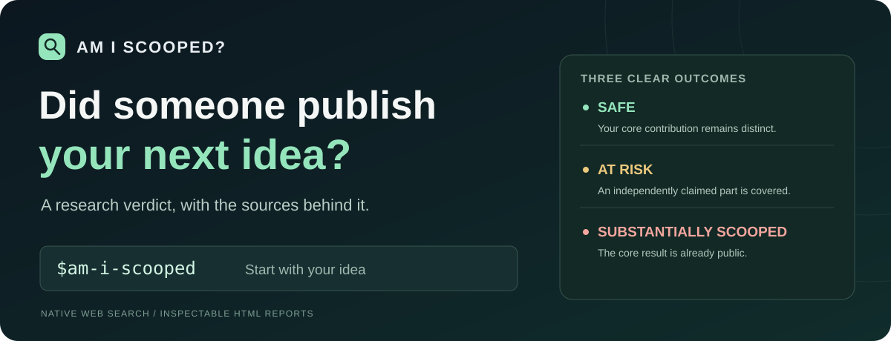
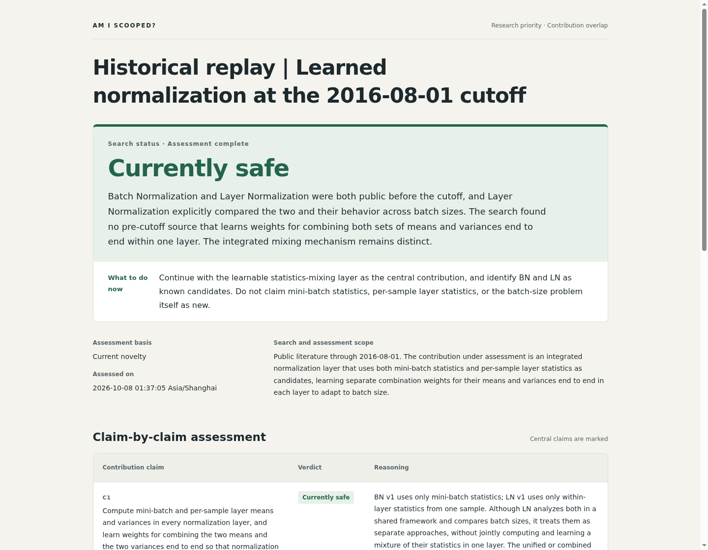
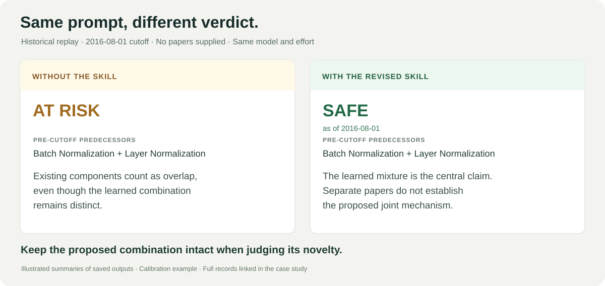

<p align="center">
  
</p>

<p align="center"><strong>English</strong> · <a href="README.zh-CN.md">简体中文</a></p>

<p align="center">
  <strong>Give Codex your idea. Let it find the papers and check the overlap.</strong><br>
  Native web search · Claim-level comparison · A report you can inspect
</p>

<p align="center">
  <a href="#quickstart">Get started</a> · <a href="#start-with-an-idea-no-papers-required">See a real search</a> · <a href="#with-and-without-the-skill">Compare the outputs</a> · <a href="docs/examples/learned-normalization/README.md">Inspect the evidence</a>
</p>

You have a research idea. A search turns up related papers. **Which ones actually cover the contribution you want to make?**

Am I scooped? is a Codex skill that searches for competing results, reads the passages that matter, and gives a direct judgment: **safe**, **at risk**, or **substantially scooped**. It compares the actual result, assumptions, and scope. Known ingredients in a new construction stay visible as background.

```text
$am-i-scooped
Here is my research idea: …
The contribution I want to claim is: …
Find relevant prior work and tell me whether it already covers this contribution.
```

## Start with an idea. No papers required.

**A saved historical replay, with a cutoff of August 1, 2016.** The user supplied a method description and a date. No paper titles, URLs, or arXiv IDs.

> Search the literature available by 2016-08-01. My proposed method uses both mini-batch statistics and per-sample layer statistics as candidate normalizers. Each normalization layer learns how to combine their means and variances end to end, to adapt to different batch sizes. Which parts already exist, and what is the overall verdict?

*English translation of the [original Chinese prompt](docs/examples/learned-normalization/prompt.txt).*

The agent found and checked the relevant papers itself:

| Found through search | What it established | What the proposed claim still required |
|---|---|---|
| [Batch Normalization, 2015](https://arxiv.org/abs/1502.03167v1) | Statistics computed across a mini-batch. | Joint use of both statistics and learned mixing weights. |
| [Layer Normalization, July 2016](https://arxiv.org/abs/1607.06450v1) | Statistics computed within one training sample. | Joint use of both statistics and learned mixing weights. |

**Result: SAFE as of the specified historical cutoff.** The known normalizers did not establish the proposed learned mixture. The report identifies the distinction, links the source passages, and records the searches used to check it.

This is a replay of a past research question. It is not a claim that this idea is new today.

<p align="center">
  <a href="docs/examples/learned-normalization/README.md"></a>
</p>

*English translation of the saved Chinese-language assessment, rendered with the English interface. [Read the walkthrough](docs/examples/learned-normalization/README.md) · [Inspect English report data](docs/examples/learned-normalization/report.en.json) · [Get the English HTML](docs/examples/learned-normalization/report.en.html) · [Original Chinese report](docs/examples/learned-normalization/report.html).*

There is also a **no-reference physics example**: the user proposes an ε-factorized differential-equation method for Feynman integrals. The agent independently finds Henn's 2013 method and 2014 worked example, maps them to the claimed contributions, and returns **substantially scooped**. [See the prompt, sources, and report](docs/examples/canonical-equations/README.md).

## With and without the skill

The same normalization prompt was given to the same model, **`gpt-5.6-sol` with high reasoning effort**, in both runs. The ordinary-search run was allowed to search and read sources normally. It was not given a weaker model or a reduced search budget.

<p align="center"></p>

| | Ordinary web-search answer | Answer with the revised skill |
|---|---|---|
| Pre-cutoff predecessors used for the verdict | Batch Normalization and Layer Normalization. | The same relevant predecessors. |
| Deciding argument | Existing components count as partial overlap, even though the learned mixture remains distinct. | The central claim is the learned mixture. Separate predecessors do not establish that mechanism. |
| Verdict at the cutoff | **At risk** | **Safe** |
| Evidence to inspect | [Saved baseline output and queries](docs/examples/learned-normalization/baseline.json) | [Claim mapping, source passages, and search log](docs/examples/learned-normalization/report.en.json) |

**This example was used during calibration, then rerun after the workflow was revised.** It shows a concrete change in claim interpretation, not an unseen accuracy benchmark or a measured speedup. The [case record](docs/examples/learned-normalization/README.md) includes the original prompt, both outputs, and provenance.

## A clear decision, with something to act on

| Decision | What it means | What the report tells you |
|---|---|---|
| 🟢 **Safe** | The central contribution remains distinct in the searched scope. | The precise difference to preserve in your paper. |
| 🟠 **At risk** | Prior work covers a contribution you independently claim, while another substantive part survives. | Which claim to narrow, credit, or reposition. |
| 🔴 **Substantially scooped** | Public technical evidence already covers the central contribution. | The decisive source and what, if anything, remains new. |

If a missing decisive source prevents a supported judgment, the report names that failure and stays unfinished. A failed search never becomes a green verdict.

You get the key findings in chat and a standalone HTML report with claim comparisons, source links, dates, inspected passages, and the actual search log. **English and Simplified Chinese reports are built in.** The model follows your language preference and prepares both the interface and report prose in that language.

## Quickstart

Install into your personal Codex skills directory:

```bash
skills_root="${CODEX_HOME:-$HOME/.codex}/skills"
mkdir -p "$skills_root"
git clone https://github.com/Alice-Shimada/am-i-scooped.git "$skills_root/am-i-scooped"
```

Then invoke `$am-i-scooped` with an idea, draft, or project description. You can name a competing paper, but you do not need to bring a reading list. Give a cutoff for a historical assessment; otherwise, it searches through the assessment date.

**Needs:** Codex with web search and source-reading tools; Python 3 for HTML export. Native subagents are used when useful. The renderer uses only Python's standard library. No separate model API, search-service key, database, or server setup is required.

## How the judgment is made

1. **Identify the actual contribution.** Preserve the mechanism, assumptions, and scope. Separate independently claimed inventions from background tools.
2. **Search several routes.** Look for the same problem, the same result through another method, and nearby terminology. Delegate independent routes when useful.
3. **Read the decisive evidence.** Check the relevant technical passages and the version in which the result became public.
4. **Challenge the comparison.** Look for a predecessor that defeats the proposed distinction, then report the verdict and the next research decision.

Accuracy comes first. Straightforward retrieval tasks may use lower subagent reasoning effort. **The skill never autonomously enables fast mode.**

<details>
<summary><strong>Inside the skill</strong></summary>

| File | Purpose |
|---|---|
| [SKILL.md](SKILL.md) | Search workflow and verdict rules. |
| [judgment.md](references/judgment.md) | Comparison logic, chronology, and false-alarm handling. |
| [report-format.md](references/report-format.md) | Structured report format. |
| [render_report.py](scripts/render_report.py) | Offline HTML export. |
| [report-template.html](assets/report-template.html) | Responsive report layout. |

```bash
python3 scripts/render_report.py report.en.json --language en --output report.en.html
python3 scripts/render_report.py report.zh-CN.json --language zh-CN --output report.zh-CN.html
```

Set JSON `language` to `en` or `zh-CN`; the CLI flag can override it. Prepare the report prose in the matching language—the renderer translates interface labels only. Older JSON files without a language retain the Chinese interface. Choose a new output filename for a revised report. The renderer formats judgments and checks their consistency; the model performs the research.

</details>

---

If this helps you make a research decision, [give the project a star](https://github.com/Alice-Shimada/am-i-scooped). Found a false alarm or a missed predecessor? [Open an issue](https://github.com/Alice-Shimada/am-i-scooped/issues) with a public example we can check.
