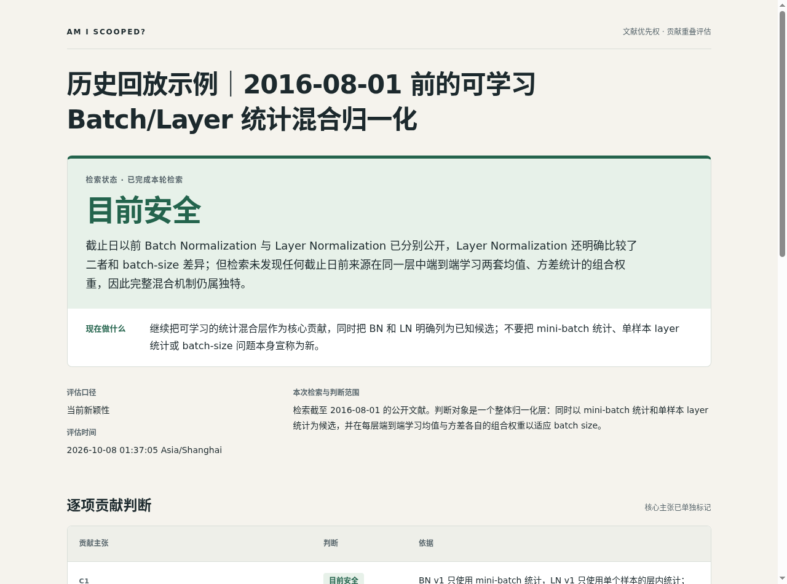
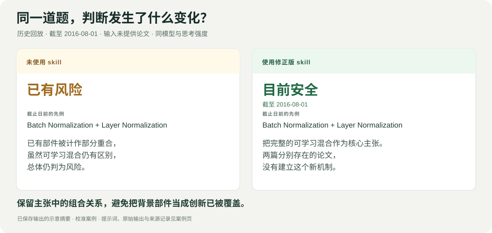

<p align="center">
  
</p>

<p align="center"><a href="README.md">English</a> · <strong>简体中文</strong></p>

<p align="center">
  <strong>把想法交给 Codex，让它自己找论文、读证据、判断重合。</strong><br>
  原生联网搜索 · 逐项核对创新 · 可回查的可视报告
</p>

<p align="center">
  <a href="#快速开始">立即使用</a> · <a href="#只给想法不用先找论文">看一次自主搜索</a> · <a href="#同一道题有无-skill-有什么不同">对比实际输出</a> · <a href="docs/examples/learned-normalization/README.zh-CN.md">查看完整证据</a>
</p>

有了一个研究想法，一搜却出来一堆相关论文。**它们到底有没有做掉你想做的创新？**

Am I scooped? 是一个 Codex skill。它会搜索竞争结果，阅读决定性的原文，明确给出 **目前安全、已有风险、几乎已被 scoop**。判断落在具体结果、假设和适用范围上；新组合中用到的已有部件，会作为背景单独列出。

```text
$am-i-scooped
我的研究想法是：……
我真正想主张的创新是：……
请自主检索已有工作，判断是否已经覆盖这项贡献。
```

## 只给想法，不用先找论文

**下面是一条已保存的历史回放，截止日期为 2016-08-01。** 用户只描述方法并指定日期，没有提供论文标题、链接或 arXiv 编号。

> 请检索截至 2016-08-01 的公开文献。我的方法主张包含两部分：(i) 同时把 mini-batch 统计和单样本 layer 统计作为候选归一化器；(ii) 每一归一化层端到端学习两者均值和方差的组合权重，从而适应不同 batch size。没有公开稿件。请分别判断已有部分和仍然独特的部分，并给出总体结论。

模型自己检索并核对了原始论文：

| 自主找到的文献 | 已经完成了什么 | 与所提主张还差什么 |
|---|---|---|
| [Batch Normalization，2015](https://arxiv.org/abs/1502.03167v1) | 跨 mini-batch 计算统计量。 | 同层联合使用两类统计，并学习混合权重。 |
| [Layer Normalization，2016 年 7 月](https://arxiv.org/abs/1607.06450v1) | 在单个训练样本内计算层统计量。 | 同层联合使用两类统计，并学习混合权重。 |

**结论：截至指定历史日期，目前安全。** 已有的归一化器没有建立所提的可学习混合机制。报告说明保留下来的创新，链接对应原文，并列出实际执行的查询。

这是过去研究问题的回放，不是在主张该想法今天仍有新颖性。

<p align="center">
  <a href="docs/examples/learned-normalization/README.zh-CN.md"></a>
</p>

*真实报告截图。[阅读完整案例](docs/examples/learned-normalization/README.zh-CN.md) · [核对报告数据](docs/examples/learned-normalization/report.json) · [获取 HTML 文件](docs/examples/learned-normalization/report.html)。*

还有一个**不提供参考文献的物理例子**：用户提出 Feynman 积分的 ε 因子化微分方程方法。模型自主找到 Henn 2013 年的方法论文和 2014 年的演示例，逐项对应创新主张，明确给出 **几乎已被 scoop**。[查看输入、来源和报告](docs/examples/canonical-equations/README.zh-CN.md)。

## 同一道题，有无 skill 有什么不同

两次运行使用同一条归一化提示词、同一个 **`gpt-5.6-sol` 模型和 high 思考强度**。普通搜索组可以照常联网和阅读来源，没有被换成更弱的模型，也没有被刻意限制搜索预算。

<p align="center"></p>

| | 普通联网搜索 | 使用修正版 skill |
|---|---|---|
| 用于判断的截止日前先例 | Batch Normalization 和 Layer Normalization。 | 同样的相关先例。 |
| 决定判断的理由 | 即使可学习混合仍有区别，也把已有部件计作部分重合。 | 核心主张是可学习混合；分散的先例并没有建立这个机制。 |
| 截止日下的结论 | **已有风险** | **目前安全** |
| 可核对的实际记录 | [原始输出与查询](docs/examples/learned-normalization/baseline.json) | [主张映射、原文位置与检索记录](docs/examples/learned-normalization/report.json) |

**这个案例参与过校准，并在流程修订后重新运行。** 它展示的是一次具体的主张理解改进，不代表未见题目的准确率，也没有测得速度提升。[完整案例记录](docs/examples/learned-normalization/README.zh-CN.md)保留原始输入、两份输出和来源信息。

## 判断明确，也告诉你下一步怎么做

| 结论 | 含义 | 报告给出的下一步 |
|---|---|---|
| 🟢 **目前安全** | 核心贡献在本次检索范围内仍然独特。 | 明确论文应该保留和突出的差异。 |
| 🟠 **已有风险** | 一项独立主张被已有工作覆盖，仍有实质贡献保留下来。 | 指出哪些主张应收窄、注明来源或重新定位。 |
| 🔴 **几乎已被 scoop** | 公开技术证据已经覆盖核心贡献。 | 给出决定性来源，以及仍然可做的具体增量。 |

如果关键来源缺失，导致无法形成有依据的判断，报告会直接指出缺失项并标为检索未完成。搜索失败不会变成绿色结论。

聊天中直接展示重点，同时生成独立 HTML 报告，包含主张对照、来源链接、公开日期、读过的段落和实际检索记录。

## 快速开始

克隆到个人 Codex skills 目录：

```bash
skills_root="${CODEX_HOME:-$HOME/.codex}/skills"
mkdir -p "$skills_root"
git clone https://github.com/Alice-Shimada/am-i-scooped.git "$skills_root/am-i-scooped"
```

然后用 `$am-i-scooped` 加上你的想法、论文草稿或项目说明即可。可以指定竞争论文，也可以完全不提供文献。需要历史判断时写明截止日期；否则默认检索至评估当天。

**运行需要：** 带联网搜索和原文读取能力的 Codex，以及用于导出 HTML 的 Python 3。独立检索有用时会调用原生子 agent。报告生成器只用 Python 标准库；无需另外配置模型 API、搜索服务密钥、数据库或应用服务器。

## 它怎样得出判断

1. **确定真正的贡献。** 保留新机制、假设与范围，把独立宣称的创新和背景工具分开。
2. **分路线检索。** 搜索同一问题、用不同方法得到的同一结果，以及相邻术语；需要时让子 agent 分头查找。
3. **核对决定性证据。** 阅读相关技术段落，确认结果出现在哪个公开版本。
4. **反向挑战结论。** 主动寻找能推翻所提差异的先例，再给出判断和研究建议。

准确性优先。简单检索任务可以降低子 agent 的思考强度。**skill 不会自主开启 fast mode。**

<details>
<summary><strong>文件结构与报告导出</strong></summary>

| 文件 | 用途 |
|---|---|
| [SKILL.md](SKILL.md) | 检索流程和判定规则。 |
| [judgment.md](references/judgment.md) | 重合判断、时间顺序与误报处理。 |
| [report-format.md](references/report-format.md) | 报告数据格式。 |
| [render_report.py](scripts/render_report.py) | 离线 HTML 导出。 |
| [report-template.html](assets/report-template.html) | 自适应报告模板。 |

```bash
python3 scripts/render_report.py report.json --output report.html
```

修订报告时使用新的输出文件名。生成器负责格式化与一致性检查，研究判断由模型完成。

</details>

---

如果它帮你做出了研究决策，欢迎[给项目一个 Star](https://github.com/Alice-Shimada/am-i-scooped)。发现误报或漏掉的先例，可以[提交 Issue](https://github.com/Alice-Shimada/am-i-scooped/issues)，附上可公开核对的例子。
